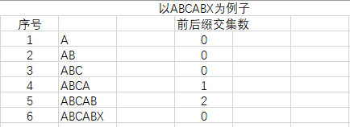

- [KMP算法](#kmp算法)
  - [注意点剖析](#注意点剖析)


# KMP算法

```C++
#include "Kmp.h"

#include <string.h>
#include <stdlib.h>

static int* get_pmt(const char* s)  // O(n)
{
    int* ret = nullptr;

    if(s)
    {   
        int len =strlen(s);
        ret = static_cast<int*>(malloc(sizeof(int) * len));
        if(ret)
        {
            int ll = 0;
            ret[0] = 0;

            for(int i = 1; i < len; i++)
            {
                // 如果匹配不上就根据当前ll值找 PMT(ll)即ret[ll-1], 一直尝试,直到找不到即 ll==0
                // 当 ll==0 就直接比对首尾, 比对上就ll+1 比不上就是ll=0;
                while((ll > 0) && (s[ll] != s[i]))
                {
                    ll = ret[ll - 1];
                }

                if(s[ll] == s[i]) //找到前缀后缀交集
                {
                    ll++;
                }

                ret[i] = ll;
            }
        }
    }

    return ret;
}

int kmp_find(const char* src, const char* sub)  // O(n) + O(n)
{
    int ret = -1;
    int src_len = strlen(src);
    int sub_len = strlen(sub);

    int* pmt = get_pmt(sub);

    for(int i = 0, j = 0; (i < src_len) && (src_len >= sub_len) && pmt; i++)
    {
        while((j > 0) && (src[i] != sub[j]))
        {
            j = pmt[j - 1]; // 目标串位置右移,相当于目标串索引J左移 
        }
        
        if(src[i] == sub[j])
        {
            j++;
            if(j == sub_len)
            {
                ret = i - j + 1;
                break;
            }
        }        
    }
    
    free(pmt);

    return ret;
}
```

***

## 注意点剖析

* 算法核心在于部分匹配表时如何生成的即```get_pmt()```

  * PMT表术语:
  1. 前缀: 除了最后一个字符以外, 一个字符的全部头部组合
  2. 后缀: 除了第一个字符外, 一个字符的全部头部组合

  * PMT表部分规则:
  1. PMT表第一个元素一定是0
  2. 如果查PMT表得到的LL值为0, 则直接比对第一个和最后一个字符  
     比对上+1, 否则为0
  
    

    * ABCAB中, 因为在ABCA中LL值为1, 所以以A为种子,向前扩展,发现AB AB也匹配则继续+1
    * ABCABX中, 因为在ABCAB中LL值为2, 所以以AB为种子,向前扩展发现 ABC ABX不匹配, 则回退一步 AB, 查询
PMT(2) == 0, 此时直接比对第一个和最后一个字符, 发现还是匹配不上, 所以为0
