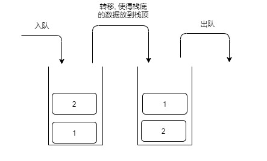

- [栈实现队列](#栈实现队列)
  - [注意点剖析](#注意点剖析)

# 栈实现队列

```C++
#ifndef STACK2QUEUE_H
#define STACK2QUEUE_H

#include "LinkStack.h"
#include "Queue.h"

namespace ZRBLib
{

template <typename T>
class Stack2Queue : public Queue<T>
{
    LinkStack<T> m_stack_in;
    LinkStack<T> m_stack_out;

    void move() const
    {
        while(m_stack_in.size())
        {
            const_cast<LinkStack<T>&>(m_stack_out).push(m_stack_in.top());
            const_cast<LinkStack<T>&>(m_stack_in).pop();
        }
    }

public:
    void add(const T& obj)
    {
        m_stack_in.push(obj);
    }

    void remove()
    {
        if(m_stack_out.size())
        {
            m_stack_out.pop();
        }
        else
        {
            THROW_EXCEPTION(InvalidOperationException, "queue is empty");
        }
    }

    T front() const
    {
        if((m_stack_out.size() <= 0) && (m_stack_in.size() > 0))
        {
            move();
        }
        else if((m_stack_out.size() <= 0) && (m_stack_in.size() <= 0))
        {
            THROW_EXCEPTION(InvalidOperationException, "queue is empty");
        }

        return m_stack_out.top();
    }

    int length() const
    {
        return m_stack_in.size() + m_stack_out.size();
    }

    void clear()
    {
        m_stack_in.clear();
        m_stack_out.clear();
    }

};
}

#endif
```

***

## 注意点剖析

* 利用2个栈方式, 一个栈负责进队列, 一个栈负责出队列  
   **只有出队的栈没有元素时才发生转移**
  

