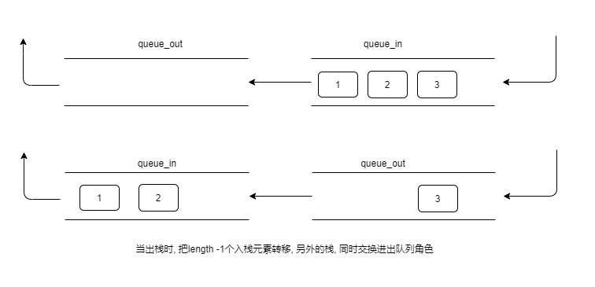

- [利用队列实现栈](#利用队列实现栈)
  - [注意点剖析](#注意点剖析)

# 利用队列实现栈

```C++
#ifndef QUEUE2STACK_H
#define QUEUE2STACK_H

#include "Stack.h"
#include "LinkQueue.h"

namespace ZRBLib
{

template <typename T>
class Queue2Stack : public Stack<T>
{
    LinkQueue<T> m_queue_1;
    LinkQueue<T> m_queue_2;

    LinkQueue<T>* m_queue_in;
    LinkQueue<T>* m_queue_out;

    void change() const
    {
        LinkQueue<T>* tmp = m_queue_in;

        const_cast<Queue2Stack<T>&>(*this).m_queue_in = m_queue_out;
        const_cast<Queue2Stack<T>&>(*this).m_queue_out = tmp;
    }

    void move() const
    {
        int len = m_queue_in->length() - 1;
        for(int i = 0; i < len; i++)
        {
            const_cast<LinkQueue<T>*>(m_queue_out)->add(m_queue_in->front());
            const_cast<LinkQueue<T>*>(m_queue_in)->remove();
        }
    }
public:
    Queue2Stack()
    {
        m_queue_in = &m_queue_1;
        m_queue_out = &m_queue_2;
    }

    void push(const T& obj)
    {
        m_queue_in->add(obj);
    }

    void pop()
    {
        if(m_queue_out->length() <= 0)
        {
            THROW_EXCEPTION(InvalidOperationException, "stack is empty");
        }

        m_queue_out->remove();
    }

    T top() const
    {
        if((m_queue_in->length() > 0) && (m_queue_out->length() <= 0))
        {
            move();
            change();
        }
        else if((m_queue_in->length() <= 0) && (m_queue_out->length() <= 0))
        {
            THROW_EXCEPTION(InvalidOperationException, "stack is empty");
        }

        return m_queue_out->front();
    }

    int size() const
    {
        return m_queue_in->length() + m_queue_out->length();
    }

    void clear()
    {
        m_queue_in->clear();
        m_queue_out->clear();
    }
};

}

#endif
```

***

## 注意点剖析

* 利用2个队列 一个负责入栈, 一个负责出栈
  


* 这里的交换角色使用交换指针方式

```C++
void change() const
{
    LinkQueue<T>* tmp = m_queue_in;

    const_cast<Queue2Stack<T>&>(*this).m_queue_in = m_queue_out;
    const_cast<Queue2Stack<T>&>(*this).m_queue_out = tmp;
}
```

